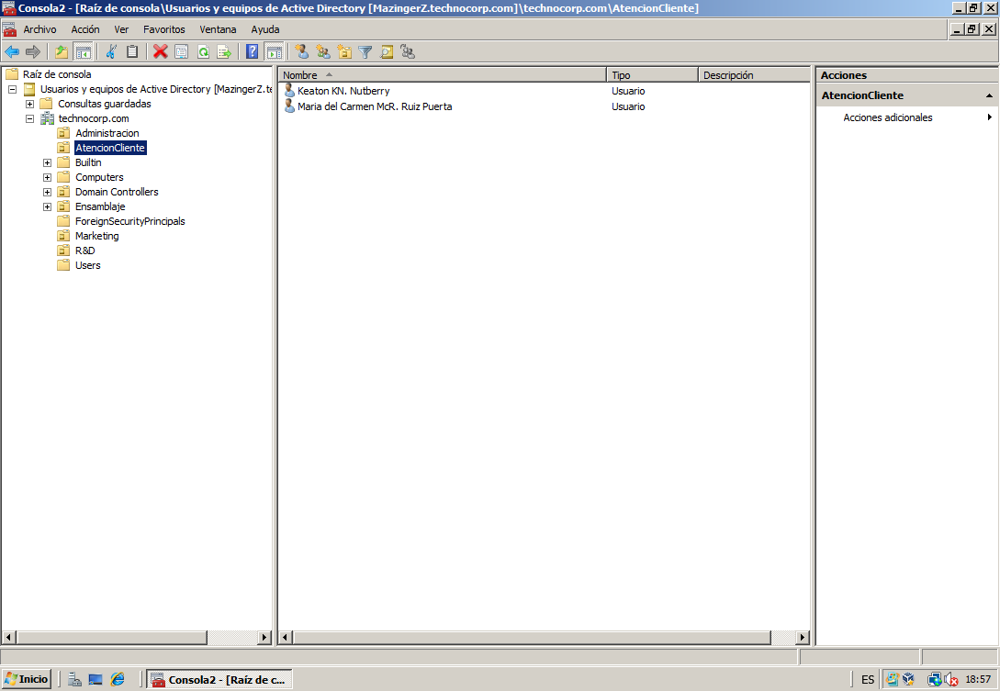
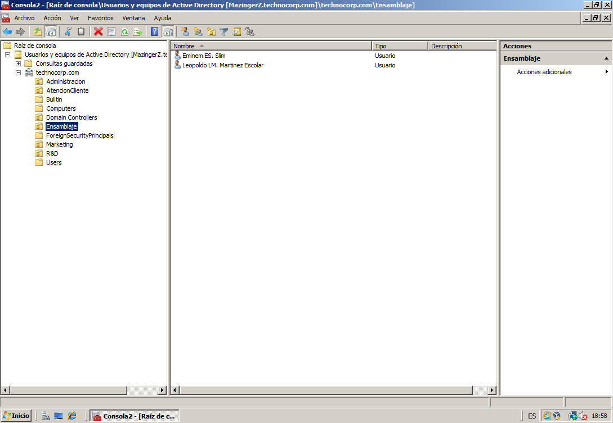
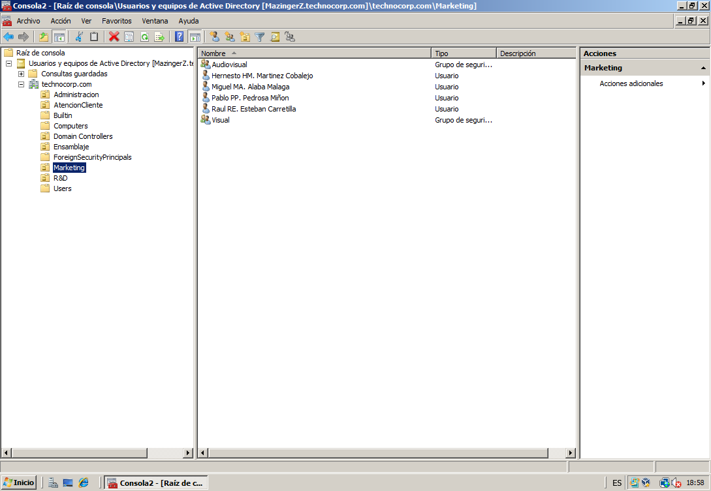
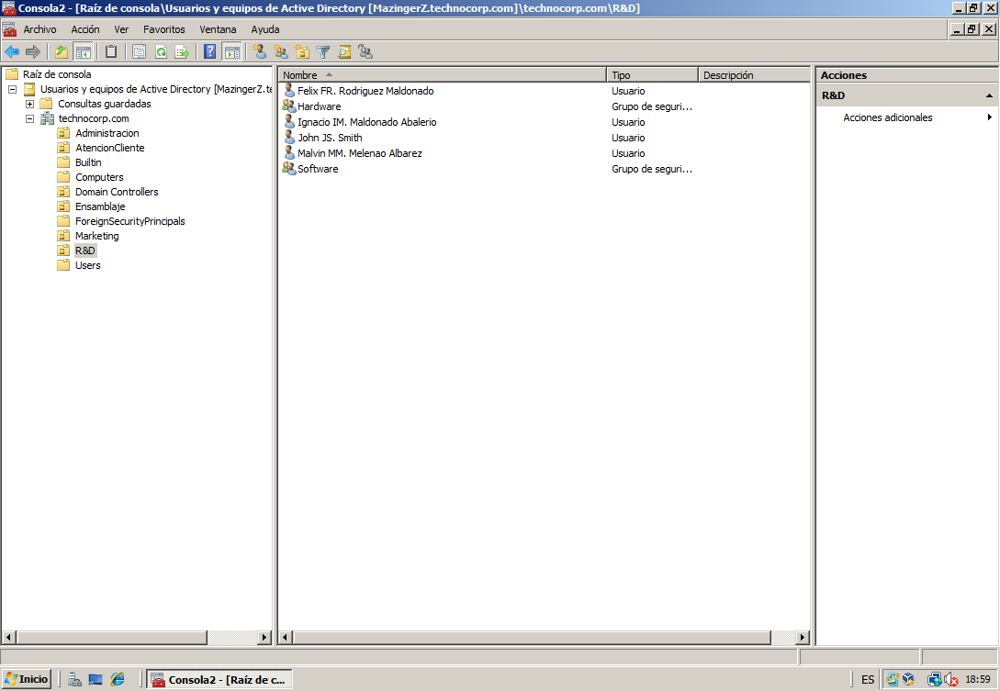
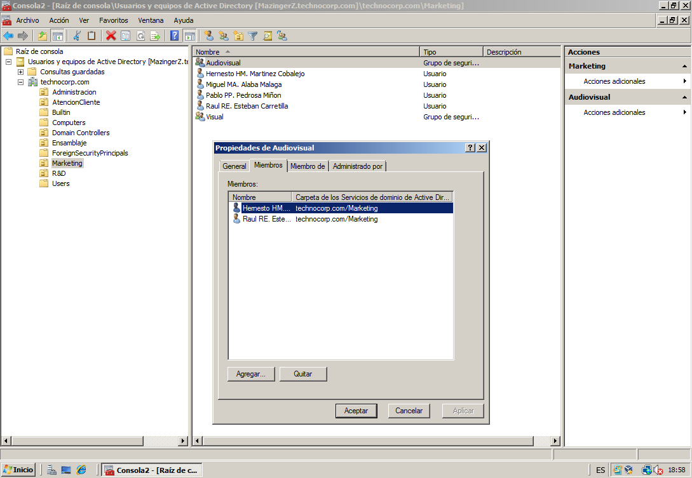
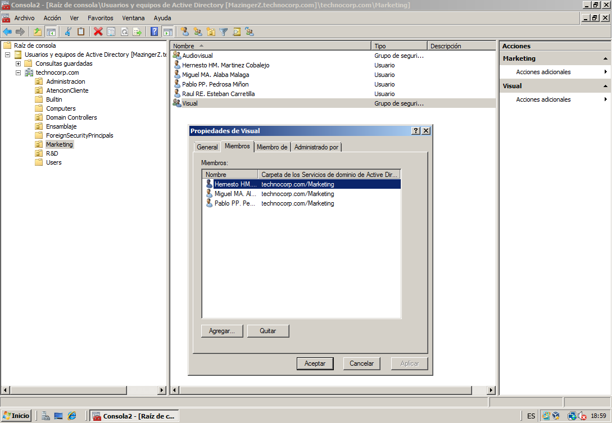
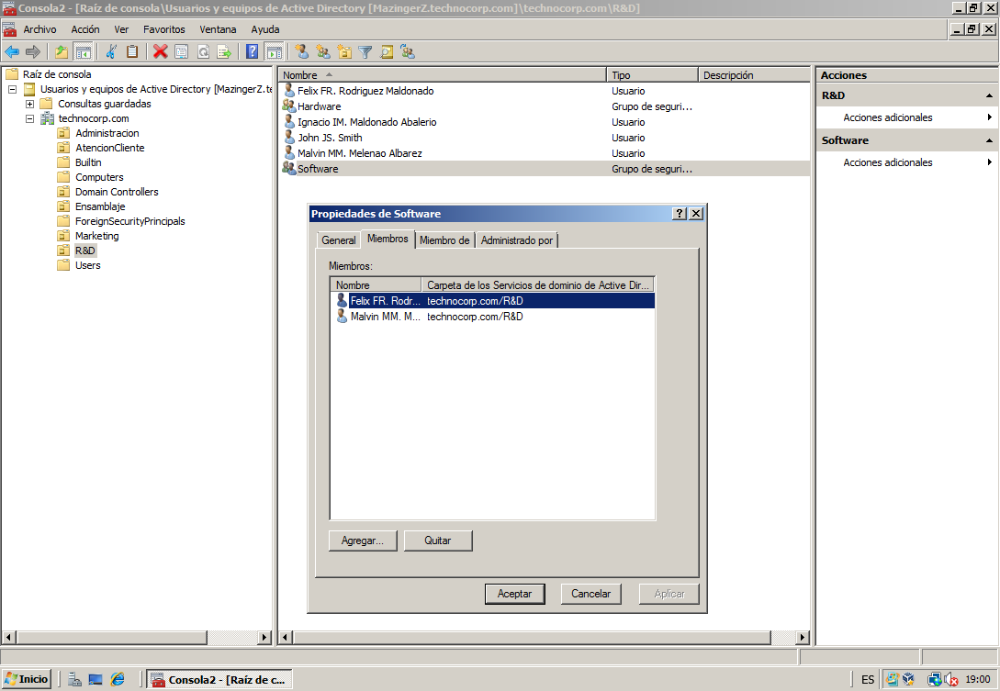
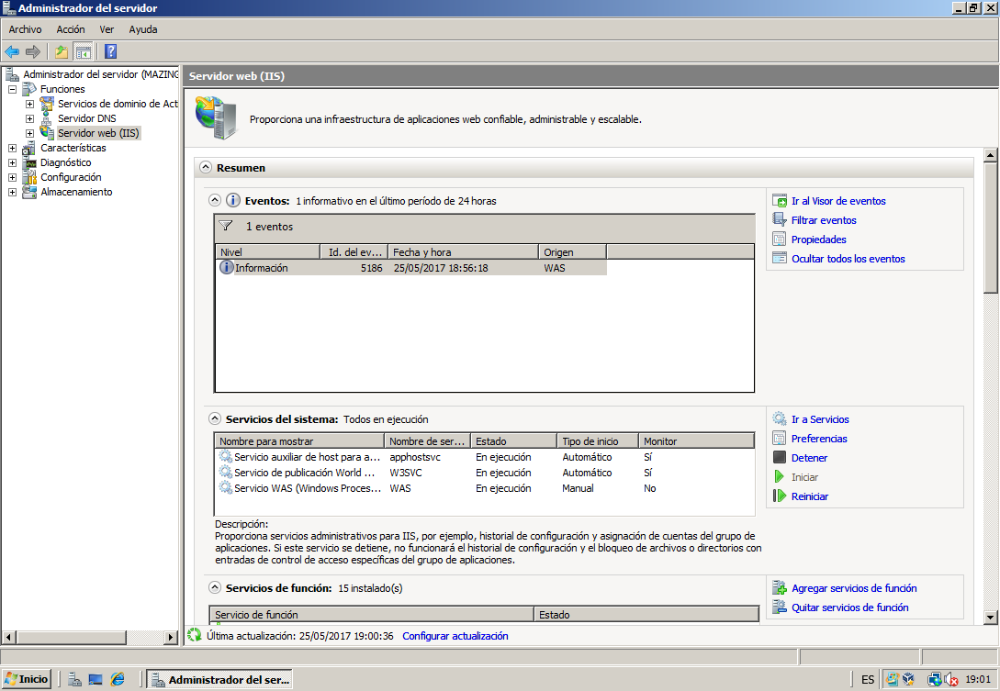
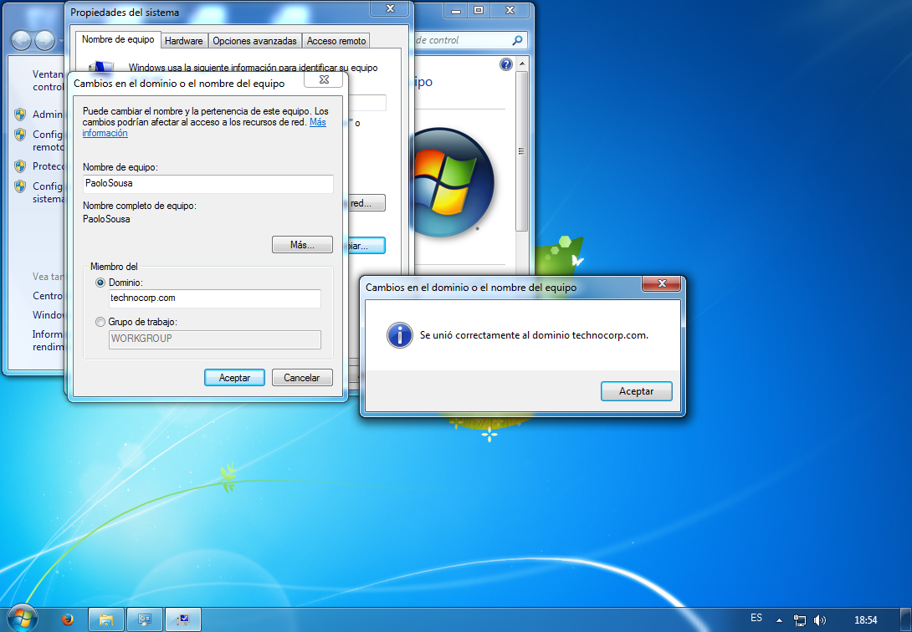
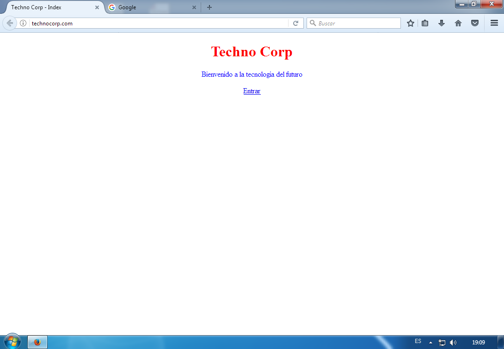

# Servidor de empresa con Windows Server 2008

* La empresa se llama Techno Corp, por lo que el `Active Directory` se llamará **technocorp.com**.

* Dividiremos las secciones de la empresa en `unidades organizativas` dentro del servidor.

Unidad de Administracion con sus grupos y usuarios:

Unidad de Atención al Cliente con sus grupos y usuarios:

Unidad de Ensamblaje con sus grupos y usuarios:

Unidad de Marketing con sus grupos y usuarios:

Unidad de Investigación y Desarrollo (Research and Developement) con sus grupos y usuarios:

* Dentro de algunas secciones existen varios grupos que se encargan de partes diferentes, lo cual se observa en los grupos diferentes que hay en algunas de estas unidades.

Grupo Audiovisual dentro de la unidad de Marketing (encargado de videos publicitarios):

Grupo Visual dentro de la unidad de Marketing (encargado de publicidad en revistas y la web):

Grupo Hardware dentro de la unidad de Investigación y Desarrollo:

Grupo Sofrware dentro de la unidad de Investigación y Desarrollo:

* Tras organizar la empresa y sus usuarios dentro del servidor de la misma forma que componen la empresa, activamos el servidor web IIS

### Comprobación

Una vez está todo configurado, comprobamos que se puede acceder a los usuarios y a la web desde un equipo externo.

* Conexión de Windows 7 a el servidor como usuario `PabloSousa` de la unidad de Administradores.

* Acceso a la página web del servidor desde la dirección `technocorp.com`.

